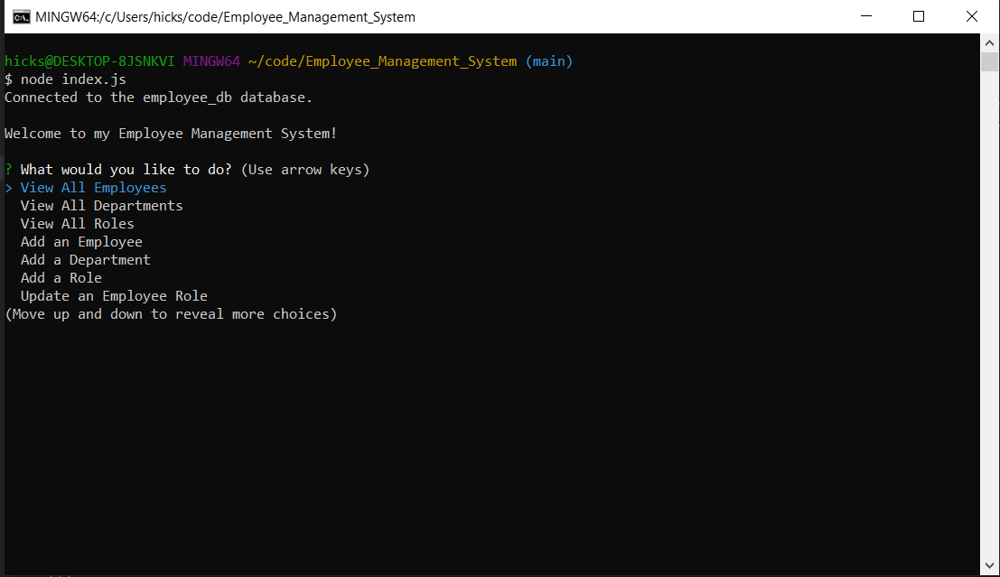

# Employee_Management_System

## Description
The Employee_Management_System is a simple node application that allows you to easily management employees. Options offered are viewing, adding & updating an employee, viewing and adding a department, and viewing and adding roles in the departments. 

## Walkthrough Video
https://youtu.be/0yHj6LScPMU

## Table of Contents
- [Installation](#installation)
- [Contribution](#contribution)
- [License](#license)
- [Contact](#contact)

## Installation
Run "npm i" in the terminal to install the required packages. After the packages are installed navigate to your MYSQL database (for example "mysql -u root -p") in the terminal and type "SOURCE schema.sql" followed by "SOURCE seeds.sql" to seed the practice data. This step is not required if you wish to start fresh. 

After the data has been seeded you can run "node index.js" in the terminal and run the terminal application. For a more in depth display on how to use the program please refer to the video link posted towards the top of this README. 

## Contribution
All coding provided by Jeff Hicks. 

## License
This project is licensed with MIT License. 

## Contact
- Author: Jeff Hicks
- Email: hicks.jeff@me.com
- Github: https://github.com/jixxin